# Queries related to the application

## Get all group names the user is a part of
Given user id $ID (= 1),

```sql
select G.`name`
  from `group` G, `group_member` GM
where
  GM.`user` = $ID
  and G.`id` = GM.`group`;
```

### Initial Query Tree
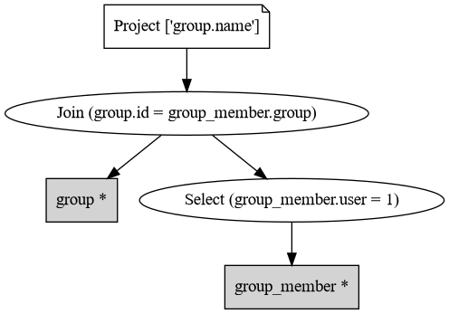

### Localized Query Tree
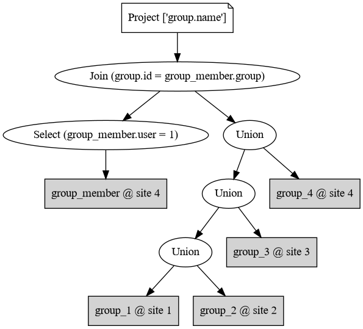

### Optimized Query Tree
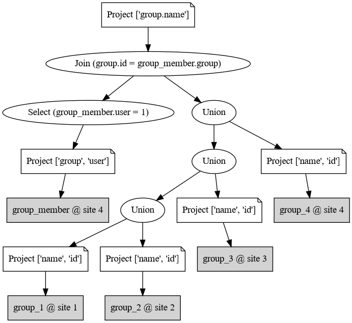

### Output
```
g12
g13
g123
```

## Get all groups the user is an admin of
Given user id $ID (= 1),

```sql
select * from `group` where `created_by` = $ID;
```
### Initial Query Tree
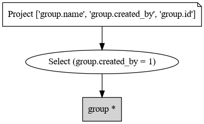

### Localized Query Tree
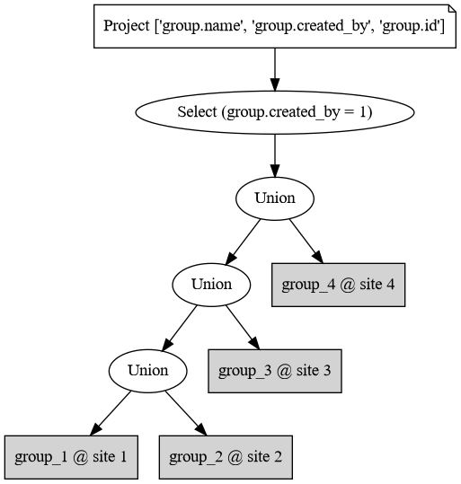

### Optimized Query Tree
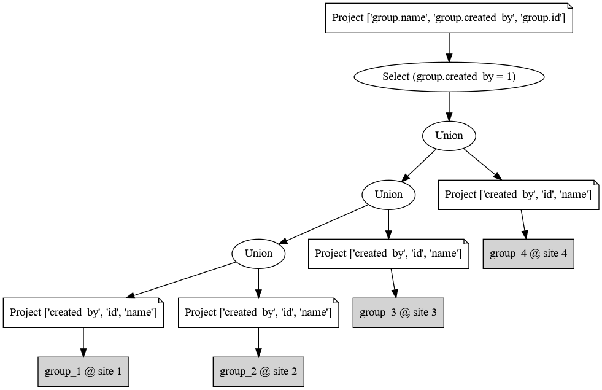

### Output
```
1,g12,1
2,g13,1
```

## Get author name, time and content of messages of a group
Given group id $ID (= 1),

```sql
select U.`name`, M.`sent_at`, M.`content`
  from `message` M, `user` U
where
  M.`group` = $ID and
  M.`author` = U.id;
```

### Initial Query Tree
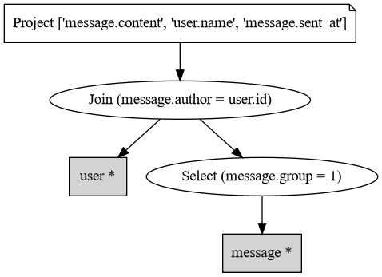

### Localized Query Tree
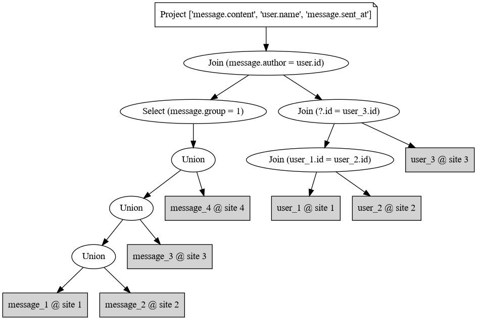

### Optimized Query Tree
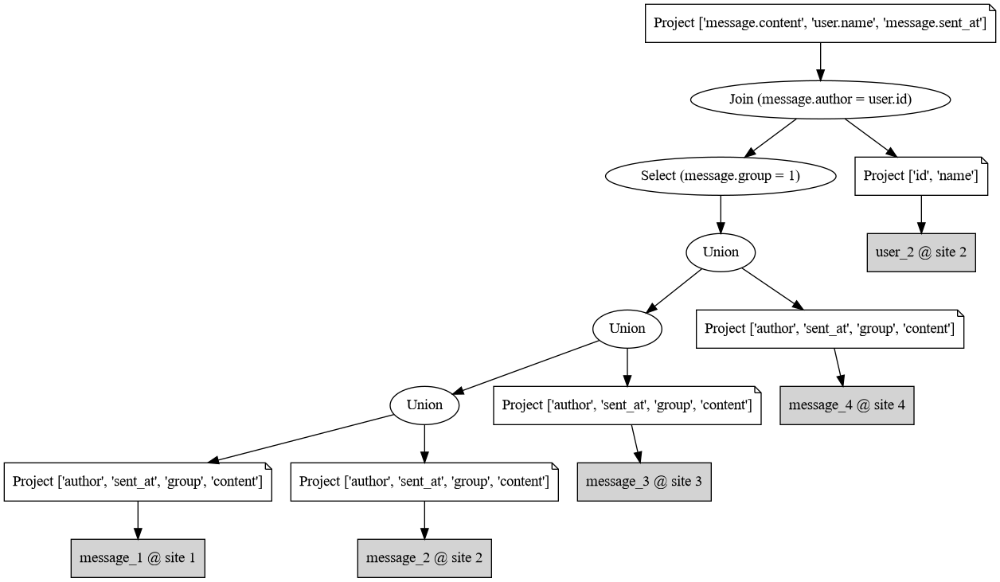

### Output
```
yk1,1647254210,hello 2
yk2,1647254211,hello 1
yk2,1647254212,what are you doing 1
yk1,1647254213,nothing
```

## Get all unseen messages of a user
Given user id $ID (= 1),

```sql
select G.`name`, M.`content`
  from `group` G, `message` M, `group_member` GM, `user` U
where
  GM.`user` = $ID and
  U.`id` = $ID and
  GM.`group` = G.`id` and
  M.`group` = G.`id` and
  M.`sent_at` > U.`last_seen`;
```

### Initial Query Tree
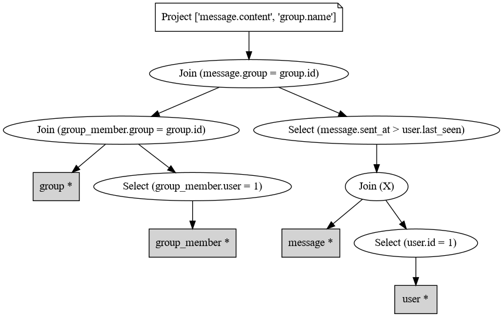

### Localized Query Tree
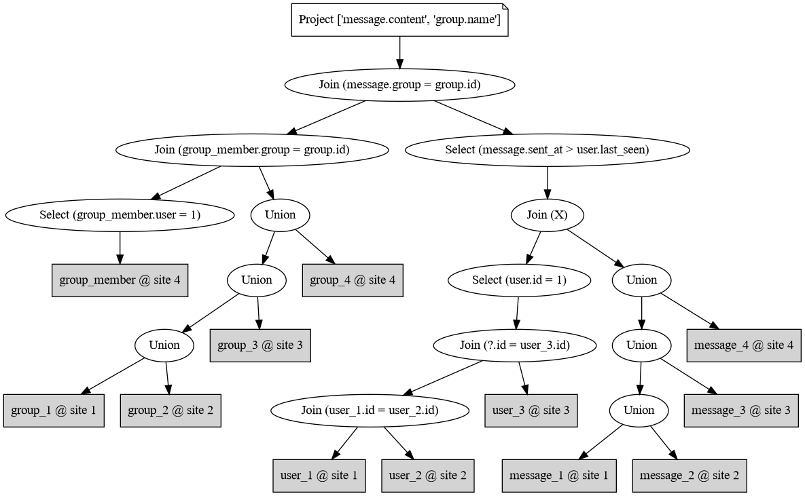

### Optimized Query Tree
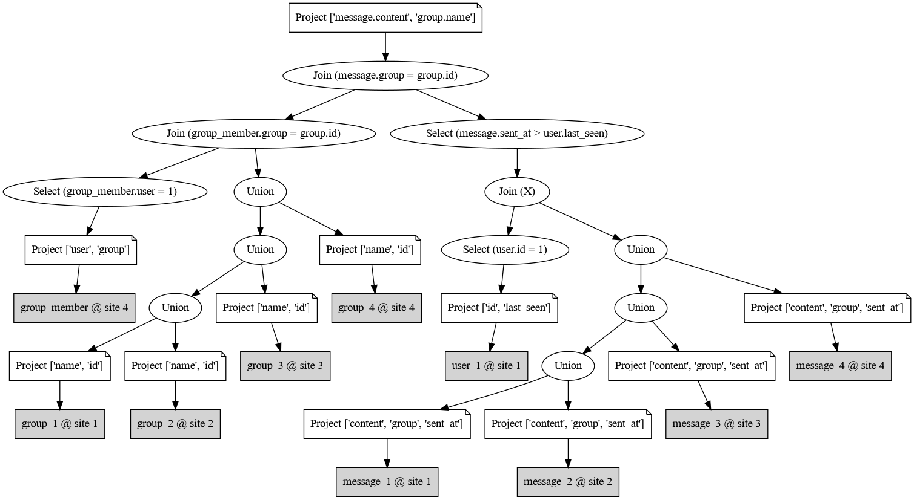

### Output
```

```

# Data structures used
 - Custom `dataclass` was made for each of the relations and system catalog tables (created dynamically from system catalog or csv files).
 - Implemented custom wrapper over `list`: `PyQL` which allowed me to use sql-like queries on previously mentioned `dataclass` objects.
 - SQL query was parsed into a custom `SelectQuery` object, which separates out everything that is needed for budding the query tree into individual components. Joins (only inner) are also translated to `where` conditions. Conditions are represented by three objects (which can be nested in each other, except `Condition`): `Condition`, `ConditionAnd`, `ConditionOr`.
 - For query tree, each type of node: `ProjectionNode`, `SelectionNode`, `UnionNode`, `JoinNode`, `RelationNode` are custom hashable classes. The graph itself is stored as `networkx.DiGraph`.

# Algorithms used
 - Parsing the select query: bunch of if conditions, storing stuff in lists and dictionaries for future ease.
 - `where` clause conditions are reduced to simplest form. (`(A && B) && C` -> `A && B && C`). Check if child conditions are of the same type as parent and extract the conditions into parent recursively.
 - Building the query tree: sort by `where` condition clauses, start with the most specific. Traverse graph from leaf nodes (`RelationNode`s) and find the root; add condition node there. If the condition refers to two or more columns, add `JoinNode`s before them.
 - Localization: break the `RelationNode`s into fragments using information from system catalog
 - Optimization: Traverse the tree from each `RelationNode` to find out which columns from that relation where used, add a project on all `RelationNode`s. For vertical fragments, remove the fragments from which no columns are used. For horizontal fragments, use `z3` solver to check if the `SelectionNode` condition and fragment predicate are compatible.
